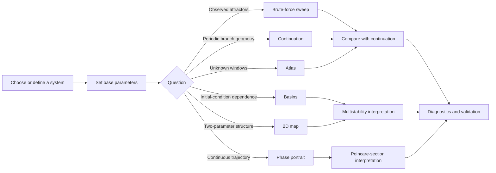

# DynamicsKit documentation

This directory is the public documentation catalog for DynamicsKit. The project has two main entry points:

- a Julia package for scripted analysis, plotting, saving, loading, and reproducible experiments;
- a local browser workbench for interactive atlas discovery, comparison, refinement, caching, and imported-system experiments.

## Documentation map

| Guide | Use it for |
| --- | --- |
| [`setup.md`](setup.md) | Installing Julia dependencies, optional frontend tooling, Docker, threading, tests, and artifact paths |
| [`julia-package.md`](julia-package.md) | Calling the library directly from Julia scripts and notebooks |
| [`workbench.md`](workbench.md) | Running and using the local browser UI and HTTP API |
| [`analysis-methods.md`](analysis-methods.md) | Choosing among brute force, continuation, atlas, skeleton, basins, phase portrait, 2D maps, and refinement |
| [`scientific-interpretation.md`](scientific-interpretation.md) | Interpreting periods, status codes, multipliers, residuals, Lyapunov diagnostics, multistability, and switching events |
| [`systems-catalog.md`](systems-catalog.md) | Built-in maps, ODEs, circuit models, parameters, and UI support |
| [`examples.md`](examples.md) | Existing example scripts plus cookbook snippets for Henon, Ikeda, Rossler, Colpitts, converters, and memristive diode bridge studies |
| [`benchmarks.md`](benchmarks.md) | Benchmark commands, metrics, and reporting guidance for cache behavior, threading, reseeding, PALC tuning, and neighbor-seeded maps |
| [`validation.md`](validation.md) | Regression targets, quality gates, and validation practices |

## End-to-end workflow

## Which interface should I use?

| Goal | Best entry point |
| --- | --- |
| Reproducible batch runs, CI, or papers | Julia package |
| Interactive exploration and manual refinement | Browser workbench |
| Parameter presets and built-in systems | Browser workbench |
| Custom research scripts | Julia package |
| Imported one-off systems without editing `src/` | Browser workbench import flow |
| Dense benchmark or validation sweeps | Julia package plus `bench/` scripts |

## Glossary

| Term | Meaning |
| --- | --- |
| Brute-force diagram | Parameter sweep that records post-transient attractor samples. It shows what a trajectory reaches from the selected initial condition. |
| Continuation branch | Curve of periodic solutions traced by pseudo-arclength continuation. It can include unstable or non-attracting orbits that a brute-force sweep will not show. |
| Skeleton | Periodic-orbit seeds found by Newton iteration from a grid or seed list. Skeletons feed continuation and atlas recovery. |
| Atlas | Automated pipeline: reconnaissance sweep, window segmentation, skeleton seeding, continuation recovery, gap retry, and optional branch switching. |
| Poincare map | Return map produced by sampling a continuous ODE each time it crosses a section. Continuation and period detection for ODEs operate on this map. |
| Period `0` | Backward-compatible "no finite period detected" value. Diagnostics explain whether this means high period, aperiodic/chaotic candidate, divergence, insufficient crossings, or solver failure. |
