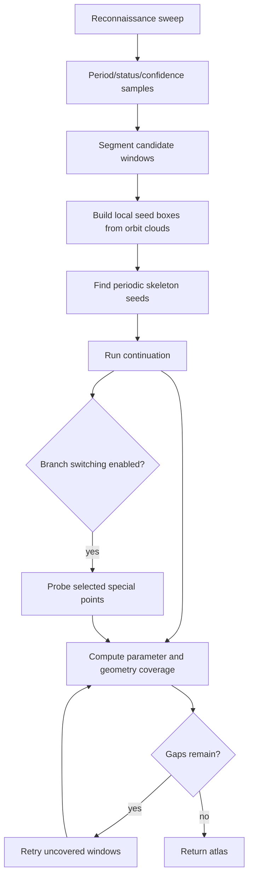

# Analysis methods

DynamicsKit provides complementary methods. They answer different scientific questions and should often be compared rather than treated as replacements for one another.

## Method selection

| Question | Method |
| --- | --- |
| What attractor do I observe from this initial condition as one parameter changes? | Brute-force diagram |
| Where are periodic solution branches, including unstable branches? | Continuation |
| Where is a whole periodic orbit and its period along a branch? | Collocation periodic-orbit continuation |
| I do not know where the periodic windows are. | Automatic continuation atlas |
| Which periodic orbits exist at one parameter value? | Periodic skeleton |
| Which attractor is reached from each initial condition? | Basins of attraction |
| What happens across two parameters? | 2D bifurcation map |
| Where does a continuation bifurcation boundary bend across two parameters? | Codimension-2 curve |
| Where are fold / flip / Neimark-Sacker points and what is their local criticality? | Map special points + normal forms |
| How does the largest Lyapunov exponent vary along one parameter? | Lyapunov diagram |
| What is the full Lyapunov spectrum at one operating point? | Lyapunov spectrum |
| What frequencies dominate an ODE regime? | Power spectrum |
| What does the ODE trajectory look like in time/state space? | Phase portrait |
| A branch/window needs more local detail. | Atlas preview/apply refinement or direct branch refinement |

## Brute-force bifurcation diagram

Function:

```julia
brute_force_diagram(sys, config; kwargs...)
```

Configuration:

| Field | Meaning |
| --- | --- |
| `param_min`, `param_max` | Sweep interval |
| `param_steps` | Number of intervals; output samples include `param_steps + 1` parameter values |
| `iterations` | Total iterates or Poincare crossings requested per parameter value |
| `transient` | Number of initial iterates/crossings discarded |
| `param_index` | Swept parameter index |
| `fixed_params` | Full base parameter vector |
| `linked_param_indices` | Additional parameter slots set to the swept value |
| `min_crossing_time` | Continuous-time only: reject very early / duplicate Poincare crossings |

Discrete maps iterate `sys.f`. Continuous ODEs integrate to Poincare crossings. The result is a cloud of observed post-transient points, not a proof that all attractors or unstable orbits were found.

## Continuation

Functions:

```julia
continuation_branch(sys, config; kwargs...)
continuation_branch(sys, config, period; kwargs...)
continuation_branches(sys, config, periods; kwargs...)
```

Configuration highlights:

| Field | Meaning |
| --- | --- |
| `p_min`, `p_max` | Parameter bounds |
| `ds`, `dsmin`, `dsmax` | Pseudo-arclength step controls |
| `max_steps` | Step budget |
| `newton_tol`, `newton_max_iter` | Newton solve controls |
| `detect_bifurcation` | BifurcationKit detection level |
| `param_index`, `linked_param_indices` | Parameter injection controls |
| `a` | PALC step-adaptation aggressiveness |
| `detect_fold` | Whether folds/limit points are recorded |
| `save_sol_every_step` | Controls full solution storage for reseeding |
| `ode_jacobian_method` | `:finite_difference` or `:variational` for ODE Poincare maps |

Important optional keywords:

| Keyword | Purpose |
| --- | --- |
| `initial_point` | Seed point in map/Poincare coordinates |
| `params` | Base parameter vector |
| `reseed` | `ReseedConfig` for interior branch-death recovery |
| `trim_to_minimal_period` | Remove lower-period aliases from period-N continuation |
| `n_initial`, `search_min`, `search_max` | Skeleton search controls for auto-seeding |
| `solver`, `reltol`, `abstol` | ODE integration controls |

Continuation can trace unstable periodic orbits. It should be interpreted together with residual, multiplier, and special-point diagnostics.

## Collocation periodic-orbit continuation

Function:

```julia
continuation_orbit_collocation(sys::ContinuousODE, config::CollocationConfig; period, params, initial_point, kwargs...)
```

An alternative to the default Poincaré return-map shooting for continuous-time systems.
Rather than continuing a fixed point of the return map, the whole time-parameterized
orbit and its period are continued as a boundary-value problem via orthogonal
collocation (BifurcationKit). Shooting stays the library default; collocation is offered
for orbits where the return-map formulation is poorly conditioned and for cross-checking
the shooting branches. A seed orbit is located near the base parameter by settling onto
the attractor and reading one cycle off a section crossing. Autonomous flows only: the
vector field is evaluated with `t` frozen at 0.

`CollocationConfig` wraps a `ContinuationConfig` (for `param_index`, `p_min`/`p_max`,
step controls, `newton_tol`, `a`, `linked_param_indices`) plus:

| Field | Meaning |
| --- | --- |
| `ntst` | Collocation mesh intervals |
| `m` | Polynomial degree per interval |
| `mesh_adapt` | Enable BifurcationKit mesh adaptation |
| `newton_max_iter` | Orbit-corrector Newton budget (collocation's first correction is heavier than shooting's) |
| `settle_time` | Flow time to settle onto the attractor before seeding |
| `seed_span_factor` | Cycles integrated for the collocation initial guess |
| `optimal_period` | Refine the seed period around the estimate |
| `bothside` | Continue in both parameter directions from the seed |

`OrbitBranchResult` carries the periodic-orbit `ContResult` and the collocation problem.
Accessors decode it: `orbit_branch_parameters`, `orbit_branch_periods`,
`orbit_branch_amplitude(result; state_index)`, and `orbit_branch_orbit(result, i)` (time
grid + `dim × L` state samples of the `i`-th orbit). Stability is reported through the
return-map monodromy (the nontrivial Floquet multipliers) via
`orbit_branch_multipliers(result, sys, i; ...)` and `orbit_branch_stability(result, sys, i; ...)`,
computed with the same variational machinery as the shooting branches — BifurcationKit's
collocation-Floquet eigenvalues are not used because their largest-magnitude entries are
dominated by spurious discretization modes.

## Map special points and normal forms

Function:

```julia
map_special_points(sys, branch::BranchResult, base_params; detect=[:pd, :fold, :ns], kwargs...)
map_normal_form(sys, kind, state, params; period=1, kwargs...)
```

Continuous-system coefficients use an adaptive centered-difference sequence (initial
step `normal_form_fd_step=3e-3`) and are returned only when three successive steps agree
in sign, classification, and scale. Unstable steps produce `status=:fd_step_unstable`
with no coefficient. Simultaneous NS eigenpairs remain separate special points and
produce `status=:multiple_critical_pairs` rather than a simple-NS coefficient.

Locates period-doubling (`:pd`), fold (`:fold`), and Neimark-Sacker (`:ns`) special points on a continued map or
Poincaré return-map branch. BifurcationKit assesses special points with the equilibrium
convention `Re(λ) < 0` on the residual `F = Π^p(x) − x`; since a map multiplier is
`μ = λ + 1`, a period-doubling (`μ → −1`) never crosses the imaginary axis and is **missed**
(folds, `μ → +1`, are caught). This routine instead uses map-native test functions on the
return-map multipliers,

- fold: `∏ᵢ(μᵢ − 1) = det(J − I)`,
- flip: `∏ᵢ(μᵢ + 1) = det(J + I)`,
- Neimark-Sacker: `|μ_c| - 1` for a tracked non-real conjugate pair,

whose sign changes mark a real multiplier crossing +1 or −1 (a complex-conjugate pair
contributes a non-negative factor, so Neimark-Sacker crossings do not produce false
fold/flip positives). Each detected sign change is refined by bisection in the arclength fraction
between the two bracketing branch points, re-solving the fixed point at each trial (robust
at folds, where the parameter is not monotonic).

Each returned `MapSpecialPoint` carries `kind`, `param`, the fixed-point `state`, the
`multipliers`, the `critical_multiplier`, the test value, a `converged` flag, and an
optional `MapNormalForm` attached by default. The normal form uses the standard
Kuznetsov/MATCONT map convention and reports coefficient `b`, `c`, or `d` plus an
explicit criticality/status. On the Hénon map the located period-1 flip (a = 0.3675) and fold (a = −0.1225) match
their closed-form values; on the peak-current-mode boost converter the subharmonic
period-doubling is recovered where BifurcationKit's own `.specialpoint` list has none.

## Border-collision classification (continuous piecewise-smooth maps)

Functions:

```julia
border_collision_classify(A_L, A_R; switching_normal=nothing, period=1, transversality=nothing, kwargs...)
border_collision_at_cycle(sys, cycle, params; period=nothing, param=NaN, events=switching_events(sys), kwargs...)
border_collision_points(sys, branch::BranchResult, base_params; events=switching_events(sys), kwargs...)
```

Classifies a border-collision bifurcation of a **continuous** piecewise-smooth map — a
fixed point or period-`q` cycle crossing a `SwitchingEvent` manifold — from the two
one-sided ordered `q`-return Jacobians `A_L` (guard-negative branch at the colliding
phase) and `A_R` (guard-positive branch), following the Feigin/Simpson/di Bernardo
determinant-sign theory:

- persistence vs nonsmooth fold: `sign(det(I − A_L)·det(I − A_R))` — `> 0` the cycle
  persists across the collision, `< 0` a nonsmooth fold (the cycle exists on one side
  only),
- companion `2q`-cycle creation: `sign(det(I + A_L)·det(I + A_R))` — `< 0` a companion
  `2q`-cycle is created.

The four generic scenarios are reported explicitly as `:persistence`,
`:nonsmooth_fold`, `:persistence_with_companion_cycle`, and
`:nonsmooth_fold_with_companion_cycle`. LU-derived determinant signs are the authoritative
classifier and avoid overflow/underflow in the verdict; the `σ₊`/`σ₋` counts (real eigenvalues above `+1` / below `−1`, since
`sign(det(I ∓ A)) = (−1)^σ` away from `±1` eigenvalues) are exported as tolerance-aware
diagnostics with a `sigma_reliable` flag. Genericity is decided from eigenvalue distance
to `±1`, not raw determinant magnitude. Stability is reported separately via the
one-sided and (for `status == :ok`) companion spectral radii; **no chaos, robust-chaos, period-adding, or
torus-creation verdict is ever inferred** from a spectral radius.

For a real period-`q` cycle (not a period-1 approximation) `border_collision_at_cycle`
reconstructs the orbit, evaluates every switching-guard component at every phase,
requires a single generic colliding phase, holds the other `q − 1` itinerary symbols
fixed, and assembles the two ordered `q`-return Jacobians that differ only at the
colliding phase. That phase's one-sided Jacobians use forced one-sided finite
differences (the base point is pushed strictly onto the target side and a Richardson
`δ`-refinement removes the leading bias — robust where branch selection invalidates
naive automatic differentiation at the border); interior phases use automatic
differentiation. `border_collision_points` detects crossings between adjacent
`BranchResult` points (a sign change of the signed nearest-border guard value),
refines each honestly in both the parameter and the periodic state by bisection with a
Newton re-solve of the period-`q` fixed point, deduplicates, and classifies.

Continuity is verified as the switching-manifold rank-one condition (`A_L − A_R` must be
rank one with row space the switching normal); a violation yields status
`:noncontinuous` and classification is refused (the theory is defined only for
continuous piecewise-smooth maps), while an unusable supplied normal yields `:invalid`.
Genericity (`:degenerate` on a `±1` eigenvalue),
transversality (`:nontransversal`), an absent or ambiguous colliding phase
(`:unavailable` / `:multiple_border_phases`), and invalid Jacobians (`:invalid`) each
have an explicit status and never produce a generic scenario. Companion-cycle
admissibility is left `nothing` (not decidable from the return Jacobians alone).
`BorderCollisionClassification` and `BorderCollisionPoint` are plain-data results with
full provenance (event, guard component, period, colliding phase, itinerary, `A_L`/`A_R`,
determinant invariants, spectra, `σ` counts, stability, continuity residual,
transversality, status, scenario, and a conservative inference string) and versioned
serializers. Validated against the Simpson (2014) 1D fixtures for all four scenarios,
2D border-collision-normal-form fixtures, and a period-2 cycle-phase fixture.


Functions:

```julia
codim2_curve(sys, config; kwargs...)
codim2_curve(sys, config, period; kwargs...)
```

`codim2_curve` offers two engines, selected by `Codim2Config.engine`:

- `:slice_tracking` (default): for each secondary-parameter value it runs a 1D continuation branch along the primary parameter, collects matching bifurcation candidates, and stitches the nearest-neighbour candidate chain into one tracked curve. Returns `Codim2CurveResult`.
- `:defining_system`: locates one point of the locus on an anchor slice, then continues the minimally augmented defining system — fixed point of the (iterated or return) map plus the eigenvector condition `(DF^N + I)v = 0` (`:pd`) or `(DF^N - I)v = 0` (`:fold`) — in the secondary parameter with pseudo-arclength continuation. Returns `Codim2ContinuationResult` whose samples follow the curve arc (including folds of the locus in either parameter), with each point solved to Newton tolerance instead of half the slice sampling distance. Supports `:pd`, `:fold`, and `:ns` (two-vector bordered system with the multiplier angle as an extra unknown). If a returned curve stops short of the requested secondary range, move `anchor_second` — a seed next to another solution sheet can stall one trace direction.

Configuration highlights:

| Field | Meaning |
| --- | --- |
| `continuation` | Primary-axis `ContinuationConfig` used for each slice |
| `second_min`, `second_max`, `second_steps` | Secondary-parameter sweep |
| `second_param_index`, `second_linked_param_indices` | Secondary-parameter injection |
| `fixed_params` | Full base parameter vector |
| `bifurcation_kind` | `:pd`, `:fold`, or `:ns` (`:hopf` accepted as an alias for `:ns`) |
| `endpoint_margin` | Reject candidates too close to the primary continuation endpoints |
| `tracking_tolerance` | Max primary-axis jump allowed when stitching neighbouring slices |
| `anchor_second`, `anchor_candidate_index` | How the stitched curve is seeded on the secondary grid |
| `diagnostics_max_points` | Sample cap for the period-doubling fallback |
| `fallback_to_stability_flips` | Allow PD detection from stable/unstable flips when special points are absent |
| `threaded` | Opt-in multithreading: concurrent slices (slice tracking) or threaded FD-Jacobian columns + curve diagnostics (defining system); defaults to `false` |
| `engine` | `:slice_tracking` (default) or `:defining_system` |
| `curve_continuation` | Optional `ContinuationConfig` for the defining-system curve leg (its bounds/step fields apply to the **secondary** parameter); `nothing` derives settings from the secondary grid |
| `curve_diagnostics` | Record per-sample fixed-point residuals and return-map multipliers on defining-system curves (default `true`) |

Interpret the slice-tracking output in two layers:

- `raw_candidates` is the full per-slice candidate inventory;
- `primary_values` + `valid_mask` is the stitched principal curve.

The slice-tracking fallback for `:pd` uses branch-stability flips when BifurcationKit does not emit explicit period-doubling special points on a slice, so `candidate_sources` and `slice_statuses` matter when assessing trustworthiness. The defining-system engine instead verifies its seed against the actual multiplier gap (a flip that is really a fold/Neimark-Sacker crossing is rejected) and records per-sample multipliers so every returned point can be checked against the defining condition.

## Reseeding

`ReseedConfig` controls targeted recovery when a continuation direction dies in the parameter interior. The branch tail is extrapolated, a local skeleton search is attempted, and a same-period seed resumes continuation if it makes progress.

| Field | Meaning |
| --- | --- |
| `enabled` | Master switch |
| `max_attempts` | Max reseed attempts per direction |
| `trailing_k` | Branch tail points used for extrapolation |
| `box_half_width_scale`, `box_half_width_min` | Local skeleton search box size |
| `min_progress_dp`, `min_progress_points` | Progress required to accept a resumed segment |
| `circulus_vitiosus_frac` | Avoid reseeding too close to the original seed |
| `n_skeleton_initial` | Local skeleton seed count |

The atlas enables reseeding by default. Direct continuation keeps it opt-in through the keyword.

## Periodic skeleton

Function:

```julia
find_periodic_skeleton(sys, periods, param_value; kwargs...)
```

The skeleton solver uses Newton iteration with automatic differentiation on `F^N(x, p) - x` for discrete maps and on the Poincare return map for continuous ODEs.

Use it when:

- you need seeds for continuation;
- you want a fixed-parameter inventory of periodic orbits;
- automatic continuation needs help with tighter `search_min`/`search_max` bounds.

## Automatic continuation atlas

Function:

```julia
continuation_atlas(sys, AtlasConfig(...); kwargs...)
```

Pipeline:



Configuration highlights:

| Field | Meaning |
| --- | --- |
| `periods` / `max_period` | Target periods |
| `brute_force` | Required reconnaissance/brute-force config |
| `continuation` | Continuation config |
| `recon_steps`, `recon_precision` | Reconnaissance grid and tolerance |
| `adaptive_recon` | Add samples near classification/confidence changes before continuation |
| `window_min_support`, `window_merge_gap` | Candidate-window segmentation |
| `seed_points_per_window`, `seed_box_padding` | Skeleton seed-box construction |
| `skeleton_retry_budget`, `continuation_retry_budget` | Recovery budgets |
| `max_refinement_depth` | Gap retry depth |
| `coverage_threshold` | Recovery threshold |
| `branch_switching` | Probe special points for connected structures |
| `reuse_neighbor_seeds` | Recycle successful skeleton seeds for nearby windows |
| `threaded` | Allow threaded substeps |
| `cache_enabled` | Allow atlas-level cache use |

The atlas reports both parameter coverage and geometry-aware orbit-cloud coverage, so a branch must match the observed support rather than merely overlap the same parameter interval.

## Phase portrait

Function:

```julia
phase_portrait(sys, PhasePortraitConfig(...); params=...)
```

Configuration:

| Field | Meaning |
| --- | --- |
| `time_start`, `time_stop` | Integration interval |
| `tail_fraction` | Fraction of the trajectory retained after transient decay |
| `poincare_crossings` | Number of crossings to keep |
| `min_crossing_time` | Ignore crossings before this time |
| `max_saved_points` | Decimation cap for trajectory samples; `0` keeps all saved points |
| `maxiters` | ODE solver iteration cap |

This is an ODE-only analysis and is usually used to inspect a representative attractor before choosing a Poincare section or sweep.

## Lyapunov diagram

Function:

```julia
lyapunov_diagram(sys, LyapunovConfig(...); kwargs...)
```

Configuration:

| Field | Meaning |
| --- | --- |
| `param_min`, `param_max`, `param_steps` | Sweep interval and resolution |
| `param_index`, `linked_param_indices` | Parameter injection controls |
| `fixed_params` | Full base parameter vector |
| `transient` | Warm-up iterates / Poincare returns discarded before estimation |
| `iterations` | Renormalized steps / returns used for the finite-time estimate |
| `perturbation` | Initial trajectory separation for the two-trajectory estimator |
| `neutral_tolerance` | Threshold for near-zero exponent classification |
| `divergence_cutoff` | Optional bailout for escaping trajectories |
| `min_crossing_time` | Continuous-time only: reject very early / duplicate Poincare crossings |

The result keeps one exponent per sampled parameter value plus estimator statuses and derived labels (`periodic`, `quasiperiodic_neutral_candidate`, `chaotic_candidate`, or `unresolved`).

## Lyapunov spectrum

Function:

```julia
lyapunov_spectrum(sys, LyapunovSpectrumConfig(...); kwargs...)
```

The full Lyapunov spectrum at a single operating point via the Benettin/QR
(tangent-space) method. Where `lyapunov_diagram` sweeps a parameter and reports only
the largest exponent from two diverging trajectories, `lyapunov_spectrum` evolves an
orthonormal tangent frame at one parameter set and recovers the whole ordered
spectrum. Discrete maps propagate the frame with the map's automatic-differentiation
Jacobian and reorthonormalize (QR) each iteration; continuous flows integrate the
first variational equation `dQ/dt = J(u(t)) Q` alongside the state and reorthonormalize
every `renorm_dt` of flow time. Each exponent is the time-averaged log of its QR
stretching factor. Stiff and auto-switching solvers are supported (the variational
right-hand side is element-type generic), and flow time is continuous across
reorthonormalization windows, so nonautonomous systems see the true `t`.

Configuration:

| Field | Meaning |
| --- | --- |
| `k` | Number of exponents from the top of the spectrum (`0` = full state dimension) |
| `transient` | Reorthonormalization intervals discarded so the frame aligns before accumulation |
| `steps` | Reorthonormalization intervals accumulated into the estimate |
| `renorm_dt` | Flow-only integration time between QR reorthonormalizations (ignored for maps) |
| `divergence_cutoff` | Optional bailout for escaping trajectories |

`LyapunovSpectrumResult` carries the `exponents` (largest to smallest), a `convergence`
matrix of the running finite-time estimates (one row per accumulated interval, one
column per exponent), the `estimation_status`, and `total_time` (iteration count for
maps, elapsed flow time for ODEs). Two invariants make the output easy to validate: the
exponents sum to the mean log volume-change rate — `log|det J|` for maps, and the
long-time average of the flow's divergence (the time-averaged trace of `J(u(t))` along
the trajectory) for flows — and a bounded, non-equilibrium flow always has one
numerically zero exponent along the trajectory direction. `plot_lyapunov_spectrum(result)`
shows the convergence of each exponent against the accumulation horizon.

## Basins of attraction

Function:

```julia
basins_of_attraction(sys, BasinsConfig(...); kwargs...)
```

Basins sweep initial conditions at a fixed parameter value. The output matrix stores detected periods, using `0` for no finite period found.

Configuration highlights:

| Field | Meaning |
| --- | --- |
| `bif_param` | Fixed parameter value |
| `max_period`, `precision` | Period detector controls |
| `iterations` | Total iterates/crossings |
| `x_min`, `x_max`, `x_steps` | First grid axis |
| `y_min`, `y_max`, `y_steps` | Second grid axis |
| `fixed_params`, `param_index` | Parameter injection |
| `min_crossing_time` | Continuous-time only: reject very early / duplicate Poincare crossings |
| `x_index`, `y_index`, `ic_template` | Full-state initial-condition grid controls |

`BasinsResult` preserves the resolved `x_index`, `y_index`, and `ic_template`, so saved grids keep their slice-plane definition.

## Branch reachability (multistability-aware continuation)

Function:

```julia
branch_reachability(sys::DiscreteMap, branches, BranchReachabilityConfig(...); basins_crosscheck=nothing, log=nothing)
```

Bridges continuation (which knows stability) and basins (which knows reach): each continued branch is reported with the basin fraction that actually reaches it, not merely as stable/unstable. At every requested parameter knot the analysis runs a basin initial-condition census, detects each seed's terminal periodic orbit (the same discrete-map period detector `basins_of_attraction` uses), and assigns that orbit to a *stable* branch identity by period-gated, phase-invariant state-space geometry.

Key guarantees:

- **Period is never branch identity.** Two branches are compared only when their minimal period matches; among same-period branches the seed is assigned by cyclic-shift-invariant cycle distance, so coexisting same-period attractors are separated by geometry. A period group is never plurality-assigned as a block.
- **Every seed is accounted for** in exactly one of seven mutually-exclusive categories — `matched`, `unmatched`, `aperiodic`, `diverged`, `unresolved` (two same-period stable branches too close to distinguish), `stability_mismatch` (matches only an unstable branch), `outside_coverage` (its period is not represented at that knot). Category fractions use the full seed census denominator and sum to one.
- **Real branch states per knot.** The branch state at each knot is linearly interpolated between bracketing continuation points and then Newton-solved to the exact period-`T` fixed point at that knot; a branch point far from the requested sample is never substituted. A branch is `covered` only when the knot lies within its continued range (± `param_tolerance`).
- **Unstable segments are rejected** from the attracting (`matched`) fractions.

Configuration highlights:

| Field | Meaning |
| --- | --- |
| `param_samples` | Explicit parameter knots to evaluate (non-empty) |
| `param_index`, `linked_param_indices`, `base_params` | Parameter injection for the varied continuation parameter |
| `x_min`/`x_max`/`x_steps`, `y_min`/`y_max`/`y_steps` | Initial-condition census grid axes |
| `x_index`, `y_index`, `ic_template` | Full-state grid slice controls |
| `max_period`, `precision`, `iterations`, `divergence_cutoff` | Seed terminal-orbit detection (matches `BasinsConfig` semantics) |
| `param_tolerance` | Coverage slack around a branch's continued range |
| `match_tolerance`, `ambiguity_ratio` | Phase-invariant match threshold and unresolved-vs-matched arbitration |
| `stability_tol`, `newton_max_iter`, `newton_tol` | Branch stability + fixed-point solve controls |
| `branch_ids` | Optional stable branch IDs (deterministic `"branch-<k>"` fallback) |
| `threaded` | Thread the per-cell census (deterministic, thread-parity safe) |
| `ode_solver`, `ode_reltol`, `ode_abstol` | *(ContinuousODE only)* Poincaré return-map integrator key (resolved by `select_ode_solver`) and tolerances |
| `min_crossing_time`, `ode_fd_step`, `ode_tmax` | *(ContinuousODE only)* launch-crossing suppression window, return-map finite-difference step, and integration horizon (`Inf` ⇒ `tspan_hint`-scaled) |

`BranchReachabilityResult` carries system/parameter provenance, the census grid, the global branch identities and periods, and one `BranchReachabilitySample` per knot (per-branch matched counts/fractions, the seven category counts, and per-cell `assignment` / `status` / `match_distance` / `terminal_period` matrices). Accessors: `reachability_category_counts`, `reachability_category_fractions`, `branch_reachability_fractions`, `branch_reachability_status_label`. Serialize with `serialize_branch_reachability_result` / `deserialize_branch_reachability_result` (format `"branch-reachability-v1"`).

Supplying `basins_crosscheck` (a `BasinsResult` per knot) validates the recomputed census against independent evidence after strict provenance checks (system, grid, indices, `ic_template`, `max_period`, parameter knot) plus a per-cell periodicity cross-check; it does not skip computation, and any mismatch is rejected. This cross-check requires `divergence_cutoff = Inf` because `BasinsResult` does not apply or record a cutoff.

### Continuous-time (Poincaré return-map) reachability

```julia
branch_reachability(sys::ContinuousODE, branches, BranchReachabilityConfig(...); basins_crosscheck=nothing, log=nothing)
```

For a `ContinuousODE` carrying a `PoincareSection`, the census runs on the section return map with the identical seven-category partition, stable-only branch identity, and full-census fractions as the discrete method:

- **Seeds are full-state initial conditions.** Each `(x_index, y_index)` grid cell perturbs the full-state `ic_template`; the seed is integrated with launch-crossing suppression (`min_crossing_time`), its terminal orbit detected on the section, and its q-crossing cycle reconstructed in **projected** section coordinates.
- **Branch states are projected section fixed points.** A branch's recorded `(x1, …)` are the section-projected coordinates; per knot they are interpolated from the bracketing continuation points and then Newton-corrected on the return map at the exact knot parameter. Stability is recomputed from the return-map multipliers using the projected states — the recorded `stable` flag is only a seed.
- **A full-state `template`** on the `PoincareSection` is required to lift projected fixed points back to full states for integration; its length must equal the system state dimension, and the projection indices must lie within it.
- **Honest degradation, never fabrication.** A branch whose return-map Newton solve does not converge (e.g. an integration horizon below one return time) is reported `uncovered` at that knot rather than matched against an uncorrected estimate; a seed the integrator cannot resolve to a bounded periodic orbit is `unresolved`. Neither throws nor invents a match.
- **`basins_crosscheck` is rejected for `ContinuousODE`** (throws): the return-map census cannot prove identical crossing semantics (warm-up, solver, horizon) against an independent `BasinsResult`, so parity is refused rather than faked.

The ODE integration is configured by `ode_solver` (resolved by `select_ode_solver`), `ode_reltol`/`ode_abstol`, `min_crossing_time`, `ode_fd_step`, and `ode_tmax`; the census is deterministic and thread-parity safe (`threaded=true`).

**Stiff systems (e.g. Murali–Lakshmanan–Chua):** prefer `ode_solver="auto"` (stiffness-aware) or an explicit stiff key such as `"rosenbrock23"`, tighten `ode_reltol`/`ode_abstol`, and raise the system `tspan_hint` (which scales the default `ode_tmax=Inf` horizon) so slow transients complete before section detection. The thesis T2.3 validation recovers stable P1/P3/P3 MDB coexistence at `a=0.0155` with full seed accounting.

## Parameter-robustness / tolerance fields

Two clearly separated layers turn a classified 2D operating map (a `BifurcationMapResult`, optionally sharpened by per-cell status codes) into an engineering robustness deliverable. Both are pure post-processing of the map — they never rerun the model.

### A. Deterministic regime-boundary margins

```julia
regime_boundary_distances(map_result::BifurcationMapResult; cells=nothing, status_codes=nothing,
                          config=RegimeBoundaryConfig(edge_policy=:censored))
# lower-level analytic overload (physical axes + integer labels + resolved mask):
regime_boundary_distances(a_grid, b_grid, labels, resolved;
                          config=RegimeBoundaryConfig(), system_name="", param_names=(:a, :b),
                          status_evidence=false)
```

For every *known-regime* cell this reports the physical Euclidean distance to the nearest regime boundary — "how far can this operating point drift before the mode changes." Method:

- **Boundary cells** are resolved cells 4-connected to a *different* known regime or to an *unknown* cell (domain edges are handled separately by the edge policy, never as an interior boundary). Boundary cells have margin `0`.
- **`distance`** is the Euclidean distance from each cell centre to the nearest boundary *cell centre*, computed with an O(NM) generalized separable squared-Euclidean **distance transform** (Felzenszwalb–Huttenlocher lower-envelope-of-parabolas) evaluated at the **true grid coordinates**, so monotone nonuniform rectilinear grids are supported exactly with no index-distance approximation and no new dependency. This is a finite-grid convention with ≤ one cell-diagonal discretization error versus the true interface.
- **`distance_a` / `distance_b`** are the per-axis (single-parameter) drift margins along each grid line; `Inf` where that line carries no boundary cell.
- **Unknown cells never become a physical regime.** An unresolved cell has no margin (`distance = NaN`, `valid = false`) and forms a boundary for its known neighbours ("margin to unknown evidence").

Classification: with status evidence, `:periodic` cells are the periodic regimes and `:aperiodic_or_high_period` / `:diverged` are distinct physical regimes when `config.aperiodic_is_regime` / `config.diverged_is_regime` (default `true`); every other status is unknown. Without status evidence the semantics are explicitly reduced to periodicity-only: period `> 0` is a known regime, period `0` is unknown (aperiodic, diverged and unresolved are indistinguishable). Exactly one of `cells::MapCellGrid` or a `status_codes` matrix may be supplied, and it is validated for shape and provenance (the status periodicity must match the map's).

`RegimeBoundaryConfig.edge_policy` sets the domain-edge treatment: `:censored` (default, open) caps the reported margin at the physical distance to the sampled edge and sets `edge_censored = true` (the value is a *lower bound* — a regime change may lie just outside the window); `:boundary` treats the edge as a genuine boundary (capped, not flagged); `:ignore` leaves the raw distance (possibly `Inf`). `RegimeBoundaryResult` carries `labels`, `resolved`, `valid`, `boundary_mask`, `boundary_kind` (`0` interior / `1` regime-adjacent / `2` unknown-adjacent / `3` both), `distance`, `distance_a`, `distance_b`, `edge_censored`, `edge_policy`, `status_evidence`, `convention`, and system/parameter provenance. Accessor: `regime_boundary_summary`. Serialize with `serialize_regime_boundary_result` / `deserialize_regime_boundary_result` (format `"regime-boundary-v1"`; `Inf` and `NaN` margins are preserved distinctly).

### B. Probabilistic component-tolerance propagation

```julia
tolerance_regime_map(map_result::BifurcationMapResult, ToleranceConfig(...); cells=nothing, status_codes=nothing)
# lower-level analytic overload:
tolerance_regime_map(a_grid, b_grid, labels, resolved, config; system_name="", param_names=(:a, :b), status_evidence=false)
```

At each nominal grid cell the two parameters are independently perturbed by the stated component tolerances (`UniformTolerance(half_width)` or `GaussianTolerance(std)`; a zero scale is an exact Dirac delta) and each perturbed operating point is classified by **nearest physical-grid-cell lookup** over the same classified surrogate — integer regime labels are never interpolated. Per cell the result tracks the probability of each regime, the nominal-regime probability with its binomial standard error and **Wilson 95% score interval**, the dominant regime/probability, the categorical entropy (bits), and the **unknown** and **out-of-domain** mass, which are retained and never renormalized away (regime probabilities + unknown + OOD partition 1).

- **Exact collapse.** If both tolerances are zero the analysis returns the deterministic exact classification with no RNG/sampling error (probability `1`, CI `[1, 1]`, entropy `0`, `n_effective = 0`). If one tolerance is zero only the other axis is sampled.
- **Bitwise reproducibility.** Each cell derives an independent `Xoshiro` stream from a stable `UInt64` mix of the global `seed` and `(i, j)`, so results are bitwise identical regardless of `threaded=false`/`true` or thread count/scheduling.

This is Monte-Carlo propagation through a *finite classified-map surrogate*, not model reruns and not a closed-form tolerance proof. `ToleranceMapResult` carries the per-regime probability matrices (`Dict{Int,Matrix}`), `nominal_regime` / `nominal_resolved` / `nominal_probability`, `dominant_regime` / `dominant_probability`, `unknown_probability`, `out_of_domain_probability`, `entropy`, `nominal_standard_error`, `nominal_ci_lower` / `nominal_ci_upper`, the tolerances/seed/sample counts, and provenance. Accessor: `tolerance_regime_summary`. Serialize with `serialize_tolerance_map_result` / `deserialize_tolerance_map_result` (format `"tolerance-map-v1"`).

## 2D bifurcation map

Function:

```julia
bifurcation_map(sys, BifurcationMapConfig(...); kwargs...)
```

Core fields:

| Field | Meaning |
| --- | --- |
| `a_min`, `a_max`, `a_steps` | First parameter axis |
| `b_min`, `b_max`, `b_steps` | Second parameter axis |
| `a_index`, `b_index` | Parameter slots for the axes |
| `a_linked_param_indices`, `b_linked_param_indices` | Linked parameter slots |
| `max_period`, `precision`, `iterations` | Classification controls |
| `base_params` | Full base parameter vector |
| `divergence_cutoff` | State-amplitude bailout |
| `min_crossing_time` | Continuous-time only: reject very early / duplicate Poincare crossings |

Advanced fields:

| Field | Purpose |
| --- | --- |
| `initial_point` | Base fixed seed used at each parameter cell |
| `reuse_neighbor_seeds` | Enable path-following traversal |
| `neighbor_transient` | Reduced transient for neighbor-accelerated traversal |
| `neighbor_tile_size_a`, `neighbor_tile_size_b` | Deterministic tile sizes for neighbor traversal |
| `multistability_initial_points` | Additional fixed seeds per parameter cell, tried alongside `initial_point` |
| `lyapunov_enabled` | Estimate largest Lyapunov exponent |
| `lyapunov_iterations`, `lyapunov_transient` | Lyapunov sampling budgets |
| `lyapunov_perturbation` | Perturbation size for two-trajectory estimates |
| `lyapunov_neutral_tolerance` | Threshold for neutral/quasiperiodic candidates |
| `adaptive_refinement_enabled` | Add sparse boundary/low-confidence refinement samples |
| `adaptive_refinement_max_depth`, `adaptive_refinement_budget` | Adaptive refinement budget controls |
| `adaptive_refinement_min_confidence`, `adaptive_refinement_confidence_delta` | Confidence triggers |

If Lyapunov diagnostics were enabled, call `lyapunov_field(result)` to extract the co-computed `LyapunovFieldResult` without re-running the map.

## Power spectrum

Function:

```julia
power_spectrum(sys, PowerSpectrumConfig(...); kwargs...)
```

Configuration:

| Field | Meaning |
| --- | --- |
| `time_start`, `time_stop` | Integration interval |
| `dt` | Uniform sampling interval for the saved signal |
| `tail_fraction` | Fraction of the saved signal retained for FFT |
| `window` | Spectral window (`:hann` or `:none`) |
| `state_index` | State coordinate analyzed |
| `maxiters` | ODE solver iteration cap |

The implementation detrends the retained tail, applies the configured window, and computes a one-sided `rfft` power spectrum. This is currently an ODE-only workflow.

## Refinement

Direct branch refinement:

```julia
refined = refine_branch(sys, branch, RefinementConfig(
    from_param=0.9,
    to_param=1.1,
    ds=0.001,
    dsmax=0.005,
))
```

The workbench offers atlas preview/apply refinement with provenance-preserving history and seam-aware splicing.
For continuous ODEs, refinement uses `ode_jacobian_method` from the originating continuation configuration unless explicitly overridden.

## Status and diagnostic vocabulary

2D map classification status codes:

| Label | Meaning |
| --- | --- |
| `unknown` | No status was assigned |
| `periodic` | A finite period was detected |
| `aperiodic_or_high_period` | No period up to `max_period`; may be chaos, quasiperiodicity, or unresolved high period |
| `diverged` | State exceeded the divergence cutoff |
| `insufficient_crossings` | Continuous system did not produce enough Poincare crossings |
| `integration_failed` | ODE solver failed |
| `invalid_state` | Non-finite state was produced |

Lyapunov classification labels:

| Label | Meaning |
| --- | --- |
| `uncomputed` | Lyapunov diagnostics were not requested |
| `periodic` | Finite-period cell, Lyapunov estimate not needed for chaos classification |
| `chaotic_candidate` | Positive largest exponent above tolerance |
| `quasiperiodic_neutral_candidate` | Exponent near zero |
| `unresolved` | Estimate unavailable or not decisive |

Border-collision classification status codes (`BorderCollisionClassification.status`):

| Label | Meaning |
| --- | --- |
| `ok` | A generic scenario was issued from the determinant signs |
| `noncontinuous` | `A_L − A_R` failed the switching-manifold rank-one condition; refused (the theory applies only to continuous piecewise-smooth maps) |
| `nontransversal` | The supplied transversality measure is below tolerance |
| `degenerate` | A one-sided return Jacobian has a `±1` eigenvalue, so a determinant invariant vanishes and the signs are ambiguous |
| `multiple_border_phases` | More than one phase or guard component lies on the border; the colliding phase is ambiguous |
| `unavailable` | No phase lies on the border, or the one-sided return Jacobians could not be formed |
| `invalid` | The one-sided Jacobians are not equally sized, square, finite matrices, or the supplied switching normal is unusable |

Border-collision scenarios (`BorderCollisionClassification.scenario`): `persistence`,
`nonsmooth_fold`, `persistence_with_companion_cycle`,
`nonsmooth_fold_with_companion_cycle`, or `undetermined` (any non-`ok` status).
