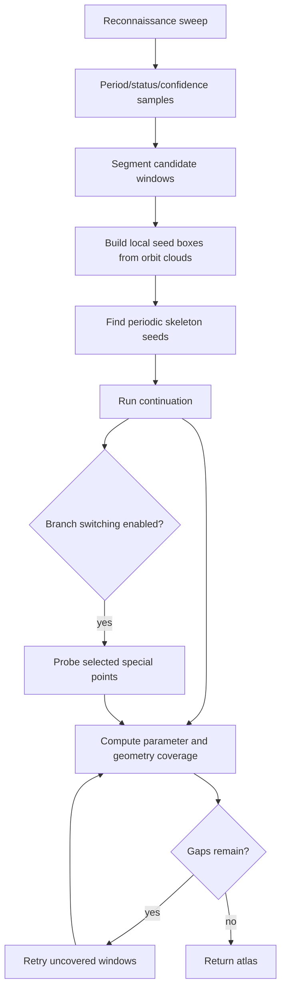

# Analysis methods

DynamicsKit provides complementary methods. They answer different scientific questions and should often be compared rather than treated as replacements for one another.

## Method selection

| Question | Method |
| --- | --- |
| What attractor do I observe from this initial condition as one parameter changes? | Brute-force diagram |
| Where are periodic solution branches, including unstable branches? | Continuation |
| Where is a whole periodic orbit and its period along a branch? | Collocation periodic-orbit continuation |
| I do not know where the periodic windows are. | Automatic continuation atlas |
| Which periodic orbits exist at one parameter value? | Periodic skeleton |
| Which attractor is reached from each initial condition? | Basins of attraction |
| What happens across two parameters? | 2D bifurcation map |
| Where does a continuation bifurcation boundary bend across two parameters? | Codimension-2 curve |
| How does the largest Lyapunov exponent vary along one parameter? | Lyapunov diagram |
| What is the full Lyapunov spectrum at one operating point? | Lyapunov spectrum |
| What frequencies dominate an ODE regime? | Power spectrum |
| What does the ODE trajectory look like in time/state space? | Phase portrait |
| A branch/window needs more local detail. | Atlas preview/apply refinement or direct branch refinement |

## Brute-force bifurcation diagram

Function:

```julia
brute_force_diagram(sys, config; kwargs...)
```

Configuration:

| Field | Meaning |
| --- | --- |
| `param_min`, `param_max` | Sweep interval |
| `param_steps` | Number of intervals; output samples include `param_steps + 1` parameter values |
| `iterations` | Total iterates or Poincare crossings requested per parameter value |
| `transient` | Number of initial iterates/crossings discarded |
| `param_index` | Swept parameter index |
| `fixed_params` | Full base parameter vector |
| `linked_param_indices` | Additional parameter slots set to the swept value |
| `min_crossing_time` | Continuous-time only: reject very early / duplicate Poincare crossings |

Discrete maps iterate `sys.f`. Continuous ODEs integrate to Poincare crossings. The result is a cloud of observed post-transient points, not a proof that all attractors or unstable orbits were found.

## Continuation

Functions:

```julia
continuation_branch(sys, config; kwargs...)
continuation_branch(sys, config, period; kwargs...)
continuation_branches(sys, config, periods; kwargs...)
```

Configuration highlights:

| Field | Meaning |
| --- | --- |
| `p_min`, `p_max` | Parameter bounds |
| `ds`, `dsmin`, `dsmax` | Pseudo-arclength step controls |
| `max_steps` | Step budget |
| `newton_tol`, `newton_max_iter` | Newton solve controls |
| `detect_bifurcation` | BifurcationKit detection level |
| `param_index`, `linked_param_indices` | Parameter injection controls |
| `a` | PALC step-adaptation aggressiveness |
| `detect_fold` | Whether folds/limit points are recorded |
| `save_sol_every_step` | Controls full solution storage for reseeding |
| `ode_jacobian_method` | `:finite_difference` or `:variational` for ODE Poincare maps |

Important optional keywords:

| Keyword | Purpose |
| --- | --- |
| `initial_point` | Seed point in map/Poincare coordinates |
| `params` | Base parameter vector |
| `reseed` | `ReseedConfig` for interior branch-death recovery |
| `trim_to_minimal_period` | Remove lower-period aliases from period-N continuation |
| `n_initial`, `search_min`, `search_max` | Skeleton search controls for auto-seeding |
| `solver`, `reltol`, `abstol` | ODE integration controls |

Continuation can trace unstable periodic orbits. It should be interpreted together with residual, multiplier, and special-point diagnostics.

## Collocation periodic-orbit continuation

Function:

```julia
continuation_orbit_collocation(sys::ContinuousODE, config::CollocationConfig; period, params, initial_point, kwargs...)
```

An alternative to the default Poincaré return-map shooting for continuous-time systems.
Rather than continuing a fixed point of the return map, the whole time-parameterized
orbit and its period are continued as a boundary-value problem via orthogonal
collocation (BifurcationKit). Shooting stays the library default; collocation is offered
for orbits where the return-map formulation is poorly conditioned and for cross-checking
the shooting branches. A seed orbit is located near the base parameter by settling onto
the attractor and reading one cycle off a section crossing. Autonomous flows only: the
vector field is evaluated with `t` frozen at 0.

`CollocationConfig` wraps a `ContinuationConfig` (for `param_index`, `p_min`/`p_max`,
step controls, `newton_tol`, `a`, `linked_param_indices`) plus:

| Field | Meaning |
| --- | --- |
| `ntst` | Collocation mesh intervals |
| `m` | Polynomial degree per interval |
| `mesh_adapt` | Enable BifurcationKit mesh adaptation |
| `newton_max_iter` | Orbit-corrector Newton budget (collocation's first correction is heavier than shooting's) |
| `settle_time` | Flow time to settle onto the attractor before seeding |
| `seed_span_factor` | Cycles integrated for the collocation initial guess |
| `optimal_period` | Refine the seed period around the estimate |
| `bothside` | Continue in both parameter directions from the seed |

`OrbitBranchResult` carries the periodic-orbit `ContResult` and the collocation problem.
Accessors decode it: `orbit_branch_parameters`, `orbit_branch_periods`,
`orbit_branch_amplitude(result; state_index)`, and `orbit_branch_orbit(result, i)` (time
grid + `dim × L` state samples of the `i`-th orbit). Stability is reported through the
return-map monodromy (the nontrivial Floquet multipliers) via
`orbit_branch_multipliers(result, sys, i; ...)` and `orbit_branch_stability(result, sys, i; ...)`,
computed with the same variational machinery as the shooting branches — BifurcationKit's
collocation-Floquet eigenvalues are not used because their largest-magnitude entries are
dominated by spurious discretization modes.

## Codimension-2 curves

Functions:

```julia
codim2_curve(sys, config; kwargs...)
codim2_curve(sys, config, period; kwargs...)
```

`codim2_curve` offers two engines, selected by `Codim2Config.engine`:

- `:slice_tracking` (default): for each secondary-parameter value it runs a 1D continuation branch along the primary parameter, collects matching bifurcation candidates, and stitches the nearest-neighbour candidate chain into one tracked curve. Returns `Codim2CurveResult`.
- `:defining_system`: locates one point of the locus on an anchor slice, then continues the minimally augmented defining system — fixed point of the (iterated or return) map plus the eigenvector condition `(DF^N + I)v = 0` (`:pd`) or `(DF^N - I)v = 0` (`:fold`) — in the secondary parameter with pseudo-arclength continuation. Returns `Codim2ContinuationResult` whose samples follow the curve arc (including folds of the locus in either parameter), with each point solved to Newton tolerance instead of half the slice sampling distance. Supports `:pd`, `:fold`, and `:ns` (two-vector bordered system with the multiplier angle as an extra unknown). If a returned curve stops short of the requested secondary range, move `anchor_second` — a seed next to another solution sheet can stall one trace direction.

Configuration highlights:

| Field | Meaning |
| --- | --- |
| `continuation` | Primary-axis `ContinuationConfig` used for each slice |
| `second_min`, `second_max`, `second_steps` | Secondary-parameter sweep |
| `second_param_index`, `second_linked_param_indices` | Secondary-parameter injection |
| `fixed_params` | Full base parameter vector |
| `bifurcation_kind` | `:pd`, `:fold`, or `:ns` (`:hopf` accepted as an alias for `:ns`) |
| `endpoint_margin` | Reject candidates too close to the primary continuation endpoints |
| `tracking_tolerance` | Max primary-axis jump allowed when stitching neighbouring slices |
| `anchor_second`, `anchor_candidate_index` | How the stitched curve is seeded on the secondary grid |
| `diagnostics_max_points` | Sample cap for the period-doubling fallback |
| `fallback_to_stability_flips` | Allow PD detection from stable/unstable flips when special points are absent |
| `threaded` | Opt-in multithreading: concurrent slices (slice tracking) or threaded FD-Jacobian columns + curve diagnostics (defining system); defaults to `false` |
| `engine` | `:slice_tracking` (default) or `:defining_system` |
| `curve_continuation` | Optional `ContinuationConfig` for the defining-system curve leg (its bounds/step fields apply to the **secondary** parameter); `nothing` derives settings from the secondary grid |
| `curve_diagnostics` | Record per-sample fixed-point residuals and return-map multipliers on defining-system curves (default `true`) |

Interpret the slice-tracking output in two layers:

- `raw_candidates` is the full per-slice candidate inventory;
- `primary_values` + `valid_mask` is the stitched principal curve.

The slice-tracking fallback for `:pd` uses branch-stability flips when BifurcationKit does not emit explicit period-doubling special points on a slice, so `candidate_sources` and `slice_statuses` matter when assessing trustworthiness. The defining-system engine instead verifies its seed against the actual multiplier gap (a flip that is really a fold/Neimark-Sacker crossing is rejected) and records per-sample multipliers so every returned point can be checked against the defining condition.

## Reseeding

`ReseedConfig` controls targeted recovery when a continuation direction dies in the parameter interior. The branch tail is extrapolated, a local skeleton search is attempted, and a same-period seed resumes continuation if it makes progress.

| Field | Meaning |
| --- | --- |
| `enabled` | Master switch |
| `max_attempts` | Max reseed attempts per direction |
| `trailing_k` | Branch tail points used for extrapolation |
| `box_half_width_scale`, `box_half_width_min` | Local skeleton search box size |
| `min_progress_dp`, `min_progress_points` | Progress required to accept a resumed segment |
| `circulus_vitiosus_frac` | Avoid reseeding too close to the original seed |
| `n_skeleton_initial` | Local skeleton seed count |

The atlas enables reseeding by default. Direct continuation keeps it opt-in through the keyword.

## Periodic skeleton

Function:

```julia
find_periodic_skeleton(sys, periods, param_value; kwargs...)
```

The skeleton solver uses Newton iteration with automatic differentiation on `F^N(x, p) - x` for discrete maps and on the Poincare return map for continuous ODEs.

Use it when:

- you need seeds for continuation;
- you want a fixed-parameter inventory of periodic orbits;
- automatic continuation needs help with tighter `search_min`/`search_max` bounds.

## Automatic continuation atlas

Function:

```julia
continuation_atlas(sys, AtlasConfig(...); kwargs...)
```

Pipeline:



Configuration highlights:

| Field | Meaning |
| --- | --- |
| `periods` / `max_period` | Target periods |
| `brute_force` | Required reconnaissance/brute-force config |
| `continuation` | Continuation config |
| `recon_steps`, `recon_precision` | Reconnaissance grid and tolerance |
| `adaptive_recon` | Add samples near classification/confidence changes before continuation |
| `window_min_support`, `window_merge_gap` | Candidate-window segmentation |
| `seed_points_per_window`, `seed_box_padding` | Skeleton seed-box construction |
| `skeleton_retry_budget`, `continuation_retry_budget` | Recovery budgets |
| `max_refinement_depth` | Gap retry depth |
| `coverage_threshold` | Recovery threshold |
| `branch_switching` | Probe special points for connected structures |
| `reuse_neighbor_seeds` | Recycle successful skeleton seeds for nearby windows |
| `threaded` | Allow threaded substeps |
| `cache_enabled` | Allow atlas-level cache use |

The atlas reports both parameter coverage and geometry-aware orbit-cloud coverage, so a branch must match the observed support rather than merely overlap the same parameter interval.

## Phase portrait

Function:

```julia
phase_portrait(sys, PhasePortraitConfig(...); params=...)
```

Configuration:

| Field | Meaning |
| --- | --- |
| `time_start`, `time_stop` | Integration interval |
| `tail_fraction` | Fraction of the trajectory retained after transient decay |
| `poincare_crossings` | Number of crossings to keep |
| `min_crossing_time` | Ignore crossings before this time |
| `max_saved_points` | Decimation cap for trajectory samples; `0` keeps all saved points |
| `maxiters` | ODE solver iteration cap |

This is an ODE-only analysis and is usually used to inspect a representative attractor before choosing a Poincare section or sweep.

## Lyapunov diagram

Function:

```julia
lyapunov_diagram(sys, LyapunovConfig(...); kwargs...)
```

Configuration:

| Field | Meaning |
| --- | --- |
| `param_min`, `param_max`, `param_steps` | Sweep interval and resolution |
| `param_index`, `linked_param_indices` | Parameter injection controls |
| `fixed_params` | Full base parameter vector |
| `transient` | Warm-up iterates / Poincare returns discarded before estimation |
| `iterations` | Renormalized steps / returns used for the finite-time estimate |
| `perturbation` | Initial trajectory separation for the two-trajectory estimator |
| `neutral_tolerance` | Threshold for near-zero exponent classification |
| `divergence_cutoff` | Optional bailout for escaping trajectories |
| `min_crossing_time` | Continuous-time only: reject very early / duplicate Poincare crossings |

The result keeps one exponent per sampled parameter value plus estimator statuses and derived labels (`periodic`, `quasiperiodic_neutral_candidate`, `chaotic_candidate`, or `unresolved`).

## Lyapunov spectrum

Function:

```julia
lyapunov_spectrum(sys, LyapunovSpectrumConfig(...); kwargs...)
```

The full Lyapunov spectrum at a single operating point via the Benettin/QR
(tangent-space) method. Where `lyapunov_diagram` sweeps a parameter and reports only
the largest exponent from two diverging trajectories, `lyapunov_spectrum` evolves an
orthonormal tangent frame at one parameter set and recovers the whole ordered
spectrum. Discrete maps propagate the frame with the map's automatic-differentiation
Jacobian and reorthonormalize (QR) each iteration; continuous flows integrate the
first variational equation `dQ/dt = J(u(t)) Q` alongside the state and reorthonormalize
every `renorm_dt` of flow time. Each exponent is the time-averaged log of its QR
stretching factor. Stiff and auto-switching solvers are supported (the variational
right-hand side is element-type generic), and flow time is continuous across
reorthonormalization windows, so nonautonomous systems see the true `t`.

Configuration:

| Field | Meaning |
| --- | --- |
| `k` | Number of exponents from the top of the spectrum (`0` = full state dimension) |
| `transient` | Reorthonormalization intervals discarded so the frame aligns before accumulation |
| `steps` | Reorthonormalization intervals accumulated into the estimate |
| `renorm_dt` | Flow-only integration time between QR reorthonormalizations (ignored for maps) |
| `divergence_cutoff` | Optional bailout for escaping trajectories |

`LyapunovSpectrumResult` carries the `exponents` (largest to smallest), a `convergence`
matrix of the running finite-time estimates (one row per accumulated interval, one
column per exponent), the `estimation_status`, and `total_time` (iteration count for
maps, elapsed flow time for ODEs). Two invariants make the output easy to validate: the
exponents sum to the mean log volume-change rate — `log|det J|` for maps, and the
long-time average of the flow's divergence (the time-averaged trace of `J(u(t))` along
the trajectory) for flows — and a bounded, non-equilibrium flow always has one
numerically zero exponent along the trajectory direction. `plot_lyapunov_spectrum(result)`
shows the convergence of each exponent against the accumulation horizon.

## Basins of attraction

Function:

```julia
basins_of_attraction(sys, BasinsConfig(...); kwargs...)
```

Basins sweep initial conditions at a fixed parameter value. The output matrix stores detected periods, using `0` for no finite period found.

Configuration highlights:

| Field | Meaning |
| --- | --- |
| `bif_param` | Fixed parameter value |
| `max_period`, `precision` | Period detector controls |
| `iterations` | Total iterates/crossings |
| `x_min`, `x_max`, `x_steps` | First grid axis |
| `y_min`, `y_max`, `y_steps` | Second grid axis |
| `fixed_params`, `param_index` | Parameter injection |
| `min_crossing_time` | Continuous-time only: reject very early / duplicate Poincare crossings |
| `x_index`, `y_index`, `ic_template` | Full-state initial-condition grid controls |

`BasinsResult` preserves the resolved `x_index`, `y_index`, and `ic_template`, so saved grids keep their slice-plane definition.

## 2D bifurcation map

Function:

```julia
bifurcation_map(sys, BifurcationMapConfig(...); kwargs...)
```

Core fields:

| Field | Meaning |
| --- | --- |
| `a_min`, `a_max`, `a_steps` | First parameter axis |
| `b_min`, `b_max`, `b_steps` | Second parameter axis |
| `a_index`, `b_index` | Parameter slots for the axes |
| `a_linked_param_indices`, `b_linked_param_indices` | Linked parameter slots |
| `max_period`, `precision`, `iterations` | Classification controls |
| `base_params` | Full base parameter vector |
| `divergence_cutoff` | State-amplitude bailout |
| `min_crossing_time` | Continuous-time only: reject very early / duplicate Poincare crossings |

Advanced fields:

| Field | Purpose |
| --- | --- |
| `initial_point` | Base fixed seed used at each parameter cell |
| `reuse_neighbor_seeds` | Enable path-following traversal |
| `neighbor_transient` | Reduced transient for neighbor-accelerated traversal |
| `neighbor_tile_size_a`, `neighbor_tile_size_b` | Deterministic tile sizes for neighbor traversal |
| `multistability_initial_points` | Additional fixed seeds per parameter cell, tried alongside `initial_point` |
| `lyapunov_enabled` | Estimate largest Lyapunov exponent |
| `lyapunov_iterations`, `lyapunov_transient` | Lyapunov sampling budgets |
| `lyapunov_perturbation` | Perturbation size for two-trajectory estimates |
| `lyapunov_neutral_tolerance` | Threshold for neutral/quasiperiodic candidates |
| `adaptive_refinement_enabled` | Add sparse boundary/low-confidence refinement samples |
| `adaptive_refinement_max_depth`, `adaptive_refinement_budget` | Adaptive refinement budget controls |
| `adaptive_refinement_min_confidence`, `adaptive_refinement_confidence_delta` | Confidence triggers |

If Lyapunov diagnostics were enabled, call `lyapunov_field(result)` to extract the co-computed `LyapunovFieldResult` without re-running the map.

## Power spectrum

Function:

```julia
power_spectrum(sys, PowerSpectrumConfig(...); kwargs...)
```

Configuration:

| Field | Meaning |
| --- | --- |
| `time_start`, `time_stop` | Integration interval |
| `dt` | Uniform sampling interval for the saved signal |
| `tail_fraction` | Fraction of the saved signal retained for FFT |
| `window` | Spectral window (`:hann` or `:none`) |
| `state_index` | State coordinate analyzed |
| `maxiters` | ODE solver iteration cap |

The implementation detrends the retained tail, applies the configured window, and computes a one-sided `rfft` power spectrum. This is currently an ODE-only workflow.

## Refinement

Direct branch refinement:

```julia
refined = refine_branch(sys, branch, RefinementConfig(
    from_param=0.9,
    to_param=1.1,
    ds=0.001,
    dsmax=0.005,
))
```

The workbench offers atlas preview/apply refinement with provenance-preserving history and seam-aware splicing.
For continuous ODEs, refinement uses `ode_jacobian_method` from the originating continuation configuration unless explicitly overridden.

## Status and diagnostic vocabulary

2D map classification status codes:

| Label | Meaning |
| --- | --- |
| `unknown` | No status was assigned |
| `periodic` | A finite period was detected |
| `aperiodic_or_high_period` | No period up to `max_period`; may be chaos, quasiperiodicity, or unresolved high period |
| `diverged` | State exceeded the divergence cutoff |
| `insufficient_crossings` | Continuous system did not produce enough Poincare crossings |
| `integration_failed` | ODE solver failed |
| `invalid_state` | Non-finite state was produced |

Lyapunov classification labels:

| Label | Meaning |
| --- | --- |
| `uncomputed` | Lyapunov diagnostics were not requested |
| `periodic` | Finite-period cell, Lyapunov estimate not needed for chaos classification |
| `chaotic_candidate` | Positive largest exponent above tolerance |
| `quasiperiodic_neutral_candidate` | Exponent near zero |
| `unresolved` | Estimate unavailable or not decisive |
