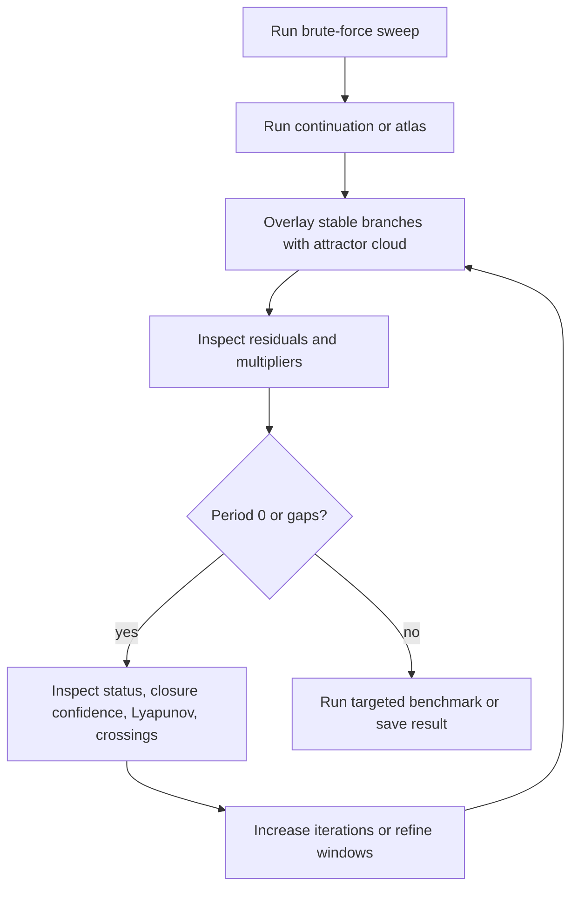

# Validation and quality gates

Validation in DynamicsKit has two layers:

- software correctness: tests, serialization, cache invariants, and package-quality (Aqua) checks;
- scientific reliability: diagnostics, cross-method comparisons, convergence checks, and benchmark reproducibility.

## Julia quality gates

Full suite:

```sh
julia --project=. -e 'using Pkg; Pkg.test()'
```

Focused targets:

```sh
julia --project=. -e 'using Pkg; Pkg.test(test_args=["quality"])'
julia --project=. -e 'using Pkg; Pkg.test(test_args=["systems"])'
julia --project=. -e 'using Pkg; Pkg.test(test_args=["brute-force"])'
julia --project=. -e 'using Pkg; Pkg.test(test_args=["lyapunov"])'
julia --project=. -e 'using Pkg; Pkg.test(test_args=["codim2"])'
julia --project=. -e 'using Pkg; Pkg.test(test_args=["spectrum"])'
julia --project=. -e 'using Pkg; Pkg.test(test_args=["continuation"])'
julia --project=. -e 'using Pkg; Pkg.test(test_args=["skeleton"])'
julia --project=. -e 'using Pkg; Pkg.test(test_args=["atlas"])'
julia --project=. -e 'using Pkg; Pkg.test(test_args=["basins-map-refine"])'
julia --project=. -e 'using Pkg; Pkg.test(test_args=["branch-reachability"])'
julia --project=. -e 'using Pkg; Pkg.test(test_args=["tolerance-fields"])'
julia --project=. -e 'using Pkg; Pkg.test(test_args=["public-api"])'
```

Contract/boundary targets: `parameter-mapping`, `accessors-contract`, `kernels-contract`, `cache-hook`.

Threaded sweep/atlas validation:

```sh
JULIA_NUM_THREADS=4 julia --project=. -e 'using Pkg; Pkg.test()'
```

The full suite includes package-quality checks through Aqua.jl, and runs in CI on every push to
`main` and every pull request (see `.github/workflows/CI.yml`).

## Scientific validation matrix

| Feature | Validation approach |
| --- | --- |
| Hidden-period atlas probes | Confirm separated same-period candidates can both be recovered |
| 2D map status outcomes | Exercise periodic, aperiodic/high-period, diverged, insufficient-crossing, integration-failure, and invalid-state cases |
| Closure confidence | Include near-recurrence samples that should remain low confidence |
| Branch multipliers | Compare stored diagnostics with recomputed spectra and ensure serialization round-trips |
| Residual norms | Verify period-map residuals remain below chosen thresholds for accepted branches |
| Minimal-period trimming | Confirm period-N continuation drops lower-period aliases when requested |
| Folded branch ordering | Confirm refinement preserves continuation ordering through non-monotone parameter folds |
| Atlas coverage | Compare parameter coverage and geometry/cloud coverage |
| Branch switching | Verify requested/applied diagnostics and budget limits |
| Neighbor seed reuse | Verify cache hit/miss diagnostics and no cross-regime contamination |
| Variational ODE derivatives | Compare against finite-difference fallback on smooth ODE cases |
| Switching events | Confirm guard-distance summaries near converter borders/clamps |
| Multistability maps | Confirm coexistence flags and basin fractions on multiseed examples |
| Branch reachability | Analytic bistable cubic map `x' = 1.5x - 0.5x^3, y' = 0.5y` (stable `(±1,0)`, unstable origin, `x=0` boundary): a symmetric even grid avoiding `x=0` splits exactly 50/50 across the two same-period P1 branches, proving same-period identity matching; plus unstable-branch zero reachability, unmatched tolerance, aperiodic/diverged accounting, category fractions summing to one, phase-invariant period-2 matching, multi-knot coverage, thread parity, evidence-crosscheck provenance rejection, config validation, and serialization round-trip. Continuous-time (Poincaré return map) reachability is covered by an analytic planar bistable radial flow `dr/dt = -(r-1)(r-2)(r-3)`, angular speed 1 (stable P1 cycles `r=1`/`r=3`, unstable separator `r=2`) on an upward `y=0` section projecting `x`: a tiny 8-seed grid straddling `r=2` splits exactly 4/4 (fractions 0.5/0.5) with both branches Newton-corrected to stable, the unstable `r=2` branch attracting zero, category partition, phase invariance across section phases, thread parity, an honest solver-horizon failure (seeds `unresolved`, branches `uncovered`, no throw/fabrication), and `basins_crosscheck`/section/config validation. Thesis validation additionally recovers MDB P1/P3/P3 coexistence at `a=0.0155` with fractions 20/28, 4/28, 4/28 and longer-transient period stability. |
| Tolerance fields | Deterministic regime-boundary margins checked against closed-form geometry: vertical and diagonal linear boundaries on uniform grids, circular-boundary discretization error ≤ one cell diagonal, genuinely nonuniform grids matched cell-for-cell against brute-force nearest boundary-cell centres, per-axis `Inf` on boundary-free lines, conservative unknown masks, and all three edge policies with censor flags. Probabilistic tolerance propagation: exact zero-tolerance collapse, one-axis-zero distributions, a Gaussian linear-boundary probability recovered against the closed-form normal CDF within Monte-Carlo error, out-of-domain mass retained (regimes + unknown + OOD partition one), Wilson intervals, status-code vs periodicity-only semantics, bitwise deterministic reruns and thread parity, config/input validation, serialization round-trip, and a moderate-grid performance measurement (`tolerance-fields` target). Thesis validation additionally grounds the margins and seeded tolerance response on the full citable D2 buck map near the recorded `R≈3.335 Ω` transition. |
| Lyapunov maps | Confirm positive/neutral/unresolved classifications on known regions |
| Lyapunov spectrum | Benettin/QR spectra recover analytic maps/ODEs, the Hénon volume invariant, and the Rössler `(+, 0, −)` signature |
| Collocation orbit continuation | Analytic radial-oscillator period/amplitude/multiplier; agreement with return-map shooting on the Vilnius and stiff MDB period-1 branches |
| Map special points | Analytic Hénon period-1 flip (a=0.3675) and fold (a=−0.1225); boost-converter subharmonic period-doubling recovered where BifurcationKit emits none |
| Border-collision classification | Simpson (2014) 1D fixtures for all four scenarios — persistence `(0.4, -0.4)`, nonsmooth fold `(2, -0.4)`, persistence-with-companion `(0.4, -1.5)`, fold-with-companion `(2, -1.5)`; 2D border-collision-normal-form fixtures with rank-one continuity; discontinuity, unusable switching normals, `±1` degeneracy, nontransversality, and marginal-stability rejections; scale/overflow checks for eigenvalue-based genericity and LU-derived determinant signs; branch-crossing location with known answer (`μ*=0`); a true period-2 cycle-phase fixture proving `q`-return handling; serialization round-trips |
| Codim-2 curve tracking | Confirm stitched curves follow the expected slice candidates and preserve source/provenance metadata |
| Adaptive 2D refinement | Analytic circular-boundary discrete map (`f(x,p) = x` inside `p₁² + p₂² < R²`, `f(x,p) = −x` outside; exact period-1/period-2 classification with zero closure error): verified period 1 at origin, period 2 at corner (0.5,0.5); strict budget never exceeded (tight budget stops all refinement, medium budget uses exactly what it consumes); deterministic replay (identical sample/cell/segment vectors on two independent runs); quadtree tiling: total leaf-cell area = domain area to 10⁻¹⁰, all sample indices valid, depth ≤ `max_depth`; boundary-segment monotonicity (finer budget → ≥ as many segments); canonical key ordering (`key_a ≤ key_b`); serialization round-trip (all fields bitwise equal); malformed-format rejection; cache deduplication (unique-coordinate count == budget used); CPU backend provenance. |
| Cache fingerprinting | Confirm implementation/schema/input changes invalidate stale artifacts |

## Cross-method validation workflow



## Documentation validation

Docs are Markdown-only and do not require Julia tests when they are the only changes. Still check:

- relative links point to existing files;
- code snippets use current constructor/function names;
- benchmark commands run from the repository root;
- internal-only planning notes are not linked from public user docs.

## Reproducibility checklist

For a result used in a report, paper figure, or comparison, record:

- commit hash or implementation fingerprint;
- Julia version;
- thread count;
- system constructor and constructor options;
- full base parameter vector;
- analysis config;
- solver and tolerances for ODEs;
- initial conditions or multiseed list;
- cache settings;
- output file path if saved;
- diagnostic summaries and warnings.

## When to rerun at higher fidelity

Rerun with stricter settings when:

- closure confidence is low near a claimed period boundary;
- residual norms are large;
- multiplier moduli are close to the unit circle;
- period `0` cells drive the conclusion;
- ODE crossing diagnostics show insufficient crossings or solver failures;
- switching guard distances are near tolerance;
- fixed-seed and neighbor-seeded maps disagree in a scientifically important region;
- multistability flags appear near the claimed regime.
