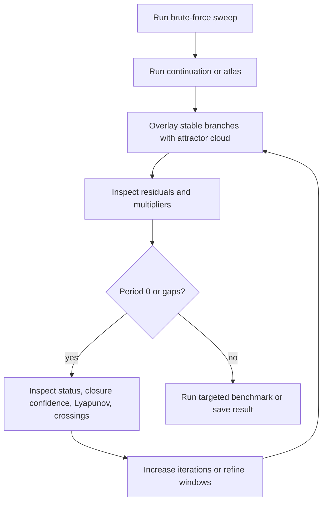

# Validation and quality gates

Validation in DynamicsKit has two layers:

- software correctness: tests, serialization, cache invariants, and package-quality (Aqua) checks;
- scientific reliability: diagnostics, cross-method comparisons, convergence checks, and benchmark reproducibility.

## Julia quality gates

Full suite:

```sh
julia --project=. -e 'using Pkg; Pkg.test()'
```

Focused targets:

```sh
julia --project=. -e 'using Pkg; Pkg.test(test_args=["quality"])'
julia --project=. -e 'using Pkg; Pkg.test(test_args=["systems"])'
julia --project=. -e 'using Pkg; Pkg.test(test_args=["brute-force"])'
julia --project=. -e 'using Pkg; Pkg.test(test_args=["lyapunov"])'
julia --project=. -e 'using Pkg; Pkg.test(test_args=["codim2"])'
julia --project=. -e 'using Pkg; Pkg.test(test_args=["spectrum"])'
julia --project=. -e 'using Pkg; Pkg.test(test_args=["continuation"])'
julia --project=. -e 'using Pkg; Pkg.test(test_args=["skeleton"])'
julia --project=. -e 'using Pkg; Pkg.test(test_args=["atlas"])'
julia --project=. -e 'using Pkg; Pkg.test(test_args=["basins-map-refine"])'
julia --project=. -e 'using Pkg; Pkg.test(test_args=["public-api"])'
```

Contract/boundary targets: `parameter-mapping`, `accessors-contract`, `kernels-contract`, `cache-hook`.

Threaded sweep/atlas validation:

```sh
JULIA_NUM_THREADS=4 julia --project=. -e 'using Pkg; Pkg.test()'
```

The full suite includes package-quality checks through Aqua.jl, and runs in CI on every push to
`main` and every pull request (see `.github/workflows/CI.yml`).

## Scientific validation matrix

| Feature | Validation approach |
| --- | --- |
| Hidden-period atlas probes | Confirm separated same-period candidates can both be recovered |
| 2D map status outcomes | Exercise periodic, aperiodic/high-period, diverged, insufficient-crossing, integration-failure, and invalid-state cases |
| Closure confidence | Include near-recurrence samples that should remain low confidence |
| Branch multipliers | Compare stored diagnostics with recomputed spectra and ensure serialization round-trips |
| Residual norms | Verify period-map residuals remain below chosen thresholds for accepted branches |
| Minimal-period trimming | Confirm period-N continuation drops lower-period aliases when requested |
| Folded branch ordering | Confirm refinement preserves continuation ordering through non-monotone parameter folds |
| Atlas coverage | Compare parameter coverage and geometry/cloud coverage |
| Branch switching | Verify requested/applied diagnostics and budget limits |
| Neighbor seed reuse | Verify cache hit/miss diagnostics and no cross-regime contamination |
| Variational ODE derivatives | Compare against finite-difference fallback on smooth ODE cases |
| Switching events | Confirm guard-distance summaries near converter borders/clamps |
| Multistability maps | Confirm coexistence flags and basin fractions on multiseed examples |
| Lyapunov maps | Confirm positive/neutral/unresolved classifications on known regions |
| Lyapunov spectrum | Benettin/QR spectra recover analytic maps/ODEs, the Hénon volume invariant, and the Rössler `(+, 0, −)` signature |
| Collocation orbit continuation | Analytic radial-oscillator period/amplitude/multiplier; agreement with return-map shooting on the Vilnius and stiff MDB period-1 branches |
| Codim-2 curve tracking | Confirm stitched curves follow the expected slice candidates and preserve source/provenance metadata |
| Adaptive 2D refinement | Confirm sparse refinement appears near period/status/confidence boundaries |
| Cache fingerprinting | Confirm implementation/schema/input changes invalidate stale artifacts |

## Cross-method validation workflow



## Documentation validation

Docs are Markdown-only and do not require Julia tests when they are the only changes. Still check:

- relative links point to existing files;
- code snippets use current constructor/function names;
- benchmark commands run from the repository root;
- internal-only planning notes are not linked from public user docs.

## Reproducibility checklist

For a result used in a report, paper figure, or comparison, record:

- commit hash or implementation fingerprint;
- Julia version;
- thread count;
- system constructor and constructor options;
- full base parameter vector;
- analysis config;
- solver and tolerances for ODEs;
- initial conditions or multiseed list;
- cache settings;
- output file path if saved;
- diagnostic summaries and warnings.

## When to rerun at higher fidelity

Rerun with stricter settings when:

- closure confidence is low near a claimed period boundary;
- residual norms are large;
- multiplier moduli are close to the unit circle;
- period `0` cells drive the conclusion;
- ODE crossing diagnostics show insufficient crossings or solver failures;
- switching guard distances are near tolerance;
- fixed-seed and neighbor-seeded maps disagree in a scientifically important region;
- multistability flags appear near the claimed regime.
